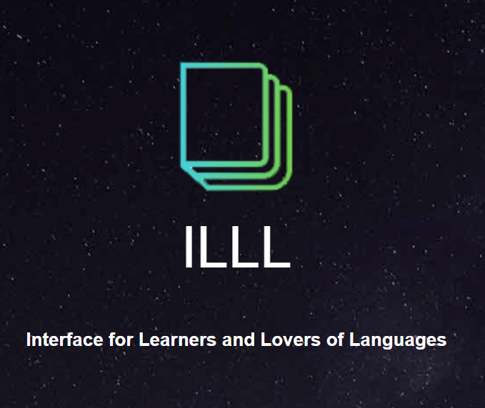

# New-Hackthon---team

# Opensouce Used
+ Bootstrap https://github.com/twbs
+ Jquery https://github.com/jquery
+ 17 Sucai https://www.17sucai.com/pins/28114.html

# What is ILLL？
+ The I-triple-L which stands for **Interface for Learners and Lovers of Languages** is an integrated user interface that incorporates the functionalities of a dictionary and a vocabulary list. The dictionary can help users to translate English words directly into Chinese, as well as record every word the user has searched. The number of times the user searched for each word will also be recorded, which can help the user to identify which words show up more frequently than others. In addition, there will be a final list of all words collected by the system which can help the app developers and instructors to see how many times each word was searched. Users can also export the list as an excel file and import it into the very famous platform Quizlet.com to build the study set to better help in learning.

# Demo 
+ http://cloudsking.com/newhack
